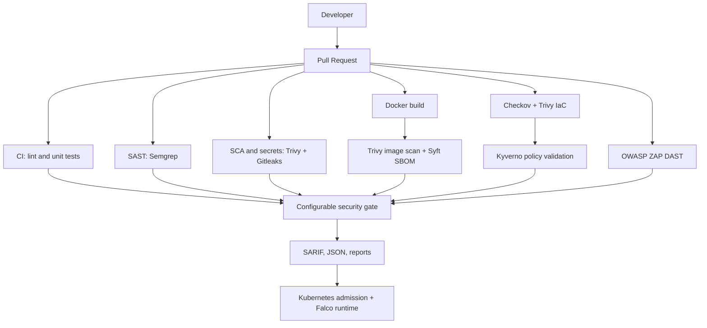

# Kubernetes Security Pipeline

A portfolio-focused DevSecOps demonstration for containerized Kubernetes workloads. It shows how code, dependencies, secrets, images, infrastructure, manifests, admission, runtime behavior, and release evidence can be brought into one security feedback loop.

> This is a lab and portfolio project, not a production-ready platform. Replace example image digests, team names, registry settings, and environment integrations before real use.

## Objectives

- Make security checks visible early in pull requests.
- Produce machine-readable and human-readable evidence.
- Fail configurable high-risk findings before deployment.
- Demonstrate secure Kubernetes defaults beside isolated negative fixtures.
- Explain the operational limits and response workflow behind each tool.

## Architecture



## Technology stack

GitHub Actions, Docker, Python, Kubernetes, Kustomize, Helm, Semgrep, Trivy, Syft, Gitleaks, Checkov, OWASP ZAP, Kyverno, Falco, and kubectl.

## Repository structure

```text
.github/workflows/       CI, security, DAST, and runtime workflows
app/                     Dependency-light demo HTTP service
docker/                  Hardened container build
kubernetes/base/         Reusable secure workload resources
kubernetes/secure/       Secure deployment composition
kubernetes/intentionally-vulnerable/  Isolated negative fixtures
helm/                    Helm packaging example
policies/kyverno/        Enforcing admission policies
scripts/                 Configurable report gate
reports/                 Sample evidence
docs/                    Architecture, threat, control, response, and test docs
examples/                Falco and policy examples
tests/                   Unit tests
```

## Local setup

Requirements: Python 3.11+, Docker, `kubectl`, Helm, Trivy, Syft, Gitleaks, Checkov, Kyverno CLI, and an isolated Kubernetes lab for deployment tests. The validation environment used for this repository is ARM64 and installs tools under `~/.local/bin`.

```bash
python3 -m unittest discover -s tests -v
make lint test
make gate
python3 -m app.main
curl -i http://127.0.0.1:8080/healthz
```

Build and inspect the image:

```bash
docker build --file docker/Dockerfile --tag secure-demo-api:local .
trivy image --severity HIGH,CRITICAL secure-demo-api:local
syft secure-demo-api:local -o cyclonedx-json=reports/local-sbom.cdx.json
```

Validate infrastructure and policies:

```bash
checkov --directory kubernetes/secure --framework kubernetes
trivy config kubernetes/secure
kyverno apply policies/kyverno --resource kubernetes/secure --table
helm template secure-demo-api helm/secure-demo-api
```

Create a disposable local cluster and validate live admission/runtime controls:

```bash
kind create cluster --name security-pipeline
helm repo add kyverno https://kyverno.github.io/kyverno/
helm repo add falcosecurity https://falcosecurity.github.io/charts
helm upgrade --install kyverno kyverno/kyverno --namespace kyverno --create-namespace
helm upgrade --install falco falcosecurity/falco --namespace falco --create-namespace \
  --set driver.kind=modern_ebpf --set tty=true
kubectl apply -f policies/kyverno
kubectl apply -k kubernetes/secure
```

The Kyverno policies exclude only the `falco` and `kyverno` namespaces because those security components require privileged or system-level operation. Application namespaces remain enforced, and the intentionally vulnerable fixture is rejected in `security-demo`.

## Pipeline and gates

`ci.yml` runs compilation, tests, and the image build. `security.yml` runs Semgrep, dependency review, Gitleaks, Trivy SCA, Checkov, Kubernetes scanning, Kyverno validation, Trivy image scanning, and Syft SBOM generation. `dast.yml` runs the OWASP ZAP baseline against the demo service. `runtime.yml` validates the Falco rule pack and documents cluster deployment ownership.

The default threshold is `HIGH`. Scanner jobs fail on configured `HIGH,CRITICAL` findings, and the final gate requires every upstream security job to succeed. The local gate supports `SECURITY_THRESHOLD=CRITICAL make gate`. Reports are uploaded as SARIF or JSON artifacts for review.

## Secure versus vulnerable lab

The secure example uses non-root execution, dropped capabilities, no privilege escalation, read-only filesystem, resource limits, digest-pinned image syntax, restricted Pod Security labels, scoped RBAC, disabled service-account token automount, and NetworkPolicy. The vulnerable example is intentionally insecure and includes privileged/root execution, host networking, hostPath, excessive capabilities, `latest`, plaintext demo secret material, missing limits, and cluster-admin binding. It must stay isolated.

## Example findings

See [reports/sample-findings.md](reports/sample-findings.md) for human-readable evidence and [reports/sample-findings.json](reports/sample-findings.json) for the gate input shape.

## Screenshots

- `[placeholder]` Pull request security checks and uploaded SARIF results.
- `[placeholder]` Kyverno admission rejection in an isolated cluster.
- `[placeholder]` Falco runtime alert correlated with Kubernetes audit data.

## Threat model and MITRE mapping

See [docs/threat-model.md](docs/threat-model.md) for assets, trust boundaries, attack surface, controls, and mappings including T1190, T1525, T1609, T1611, and T1613.

## Testing and limitations

Tests cover service behavior, response headers, report parsing, and severity gates. Scanner behavior is represented by CI commands and negative fixtures; installing every tool and running a cluster is environment-dependent. Production improvements should include signed attestations, OIDC-based publishing, protected environments, centralized audit and Falco logging, secret management, policy exception governance, and a real deployment target.

## Portfolio note

This project is designed to demonstrate security engineering judgment: controls are tied to threats, failures produce evidence, negative tests are isolated, and the documentation distinguishes a reproducible lab from production recommendations.
