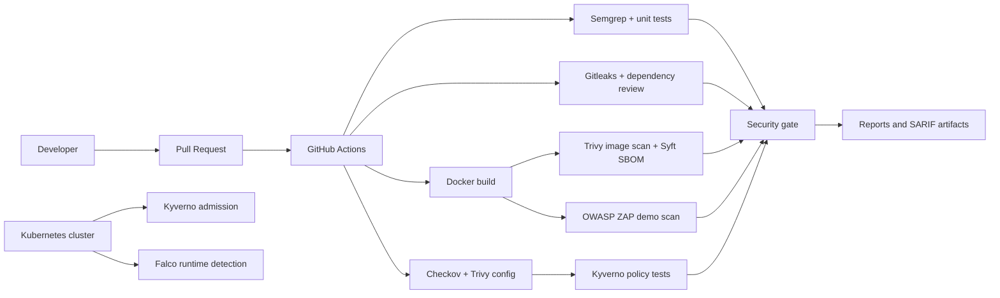

# Architecture

The pipeline is intentionally split into CI, security, DAST, and runtime workflows so failures are attributable and artifacts remain reviewable. The runtime workflow validates the rule pack; production deployment of Falco requires cluster-level operational ownership.

## Trust boundaries

- Source control to GitHub Actions runner: untrusted pull request code executes only with read-only repository permissions.
- Runner to container registry: image publishing is outside this demo and should use short-lived OIDC credentials.
- Cluster API to workload: Kubernetes admission policies enforce controls before scheduling.
- Workload to network: namespace and pod NetworkPolicies restrict ingress and egress.
- Workload to host: non-root, dropped capabilities, read-only filesystem, and restricted Pod Security reduce host exposure.
